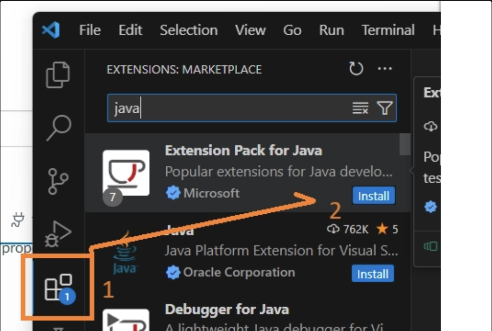

<div align="center">

# Mac Setup
*<font color="#8b949e">Development environment setup for macOS</font>*

<font color="#3fb950">Environment Configuration</font>

</div>

---

## <font color="#388bfd">Table of Contents</font>

1. [Open the built-in Terminal and confirm your Unix shell](#1-terminal)
2. [Download an authenticator app for two-factor authentication](#2-authenticator-app)
3. [Create your GitHub account and enable two-factor authentication](#3-github-account)
4. [Install Homebrew, the macOS package manager](#4-homebrew)
5. [Install Git with Homebrew](#5-git)
6. [Install GitKraken and sign in with your GitHub account](#6-gitkraken)
7. [Install VS Code and the Java extension pack](#7-visual-studio-code)
8. [Check your chip type and install Java 25 LTS](#8-java-25-lts)
9. [Verify that Git, Java, and Homebrew all work](#9-verify-your-setup)
10. [Add a photo and submit your GitHub profile URL](#10-update-your-github-profile)

---

## <font color="#388bfd">1. Terminal</font>

macOS comes with Terminal built in. No installation required.

Open it with Spotlight: press **Cmd + Space**, type `Terminal`, and press Return.

You will see a prompt like this:

```
yourname@MacBook-Air ~ %
```

> **Note:**
> The `%` means your shell is **zsh** — macOS's default since Catalina (2019). All Terminal lessons in this course use zsh. If your prompt ends with `$` instead, run `chsh -s /bin/zsh` and restart Terminal.

Your Unix terminal is ready. The remaining steps install the tools you will use with it.

---

## <font color="#388bfd">2. Authenticator App</font>

Before creating your GitHub account, download an authenticator app on your smartphone. You will need it to set up two-factor authentication.

Choose one of these free options:

- Authy
- Google Authenticator
- Microsoft Authenticator
- Passwords *(Apple — iOS 18 only)*
- Duo Mobile

After installing, sign up using your **personal email address**.

---

## <font color="#388bfd">3. GitHub Account</font>

Create a GitHub account using your **personal email address** — this is the account you will use for the rest of the course.

After creating it, enable **two-factor authentication**:

1. Go to **Settings → Password and Authentication → Two-factor Authentication**
2. Follow the prompts
3. When shown a QR code, scan it with the authenticator app you installed in step 2

---

## <font color="#388bfd">4. Homebrew</font>

Homebrew is a package manager for macOS that makes installing developer tools straightforward.

Open **Terminal** and paste the command from the [Homebrew installation page](https://brew.sh/). It will look something like:

```bash
/bin/bash -c "$(curl -fsSL https://raw.githubusercontent.com/Homebrew/install/HEAD/install.sh)"
```

Follow the prompts. Homebrew may install Xcode Command Line Tools first — allow it.

---

## <font color="#388bfd">5. Git</font>

Once Homebrew is installed, install Git:

```bash
brew install git
```

Verify it worked:

```bash
git --version
# git version 2.x.x
```

> **Tip:**
> If `git --version` says "command not found", close Terminal and reopen it, then try again.

---

## <font color="#388bfd">6. GitKraken</font>

GitKraken is a visual interface for Git that you'll use in class.

1. Download and install GitKraken from [gitkraken.com/download](https://www.gitkraken.com/download)
2. Open GitKraken and sign in with the GitHub account you just created

> **Note:**
> Sign up for the **Free** plan — do not start a paid trial or enter any payment information. Everything in this course works on the free plan.

---

## <font color="#388bfd">7. Visual Studio Code</font>

1. Download and install VS Code from [code.visualstudio.com/download](https://code.visualstudio.com/download)
2. Open VS Code
3. Open the Extensions panel (`Cmd + Shift + X`)
4. Search `java` and install: **Extension Pack for Java**



---

## <font color="#388bfd">8. Java 25 LTS</font>

### <font color="#79c0ff">Check your chip type first</font>

macOS runs on two different chip architectures and you must download the matching Java installer.

1. Click the **Apple menu** (top-left corner of your screen)
2. Select **About This Mac**
3. Look at the **Chip** or **Processor** field:

| What it says | Your chip |
|---|---|
| Apple M1, M2, M3, M4… | M-chip (Apple Silicon) |
| Intel Core i5, i7, i9… | Intel |

### <font color="#79c0ff">Download Java 25 LTS</font>

Go to [Mac Java Downloads — Oracle](https://www.oracle.com/java/technologies/downloads/#jdk25-mac) and download the right installer:

| Chip | Installer to download |
|---|---|
| Intel Mac | **x64 DMG Installer** |
| M-chip Mac | **ARM64 DMG Installer** |

Open the `.dmg` file and follow the installation prompts.

---

## <font color="#388bfd">9. Verify Your Setup</font>

### <font color="#79c0ff">Confirm your terminal environment</font>

Open Terminal and check the three core tools:

```bash
git --version
# git version 2.x.x

java -version
# java version "25.x.x"

brew --version
# Homebrew x.x.x
```

All three should print version numbers, not errors.

### <font color="#79c0ff">Run a Java program in VS Code</font>

1. Open VS Code
2. Create a new file called `Hello.java`
3. Paste this code:

```java
public class Hello {
    public static void main(String[] args) {
        System.out.println("Setup complete!");
    }
}
```

4. Click **Run** (or press `F5`)
5. The VS Code terminal should print: `Setup complete!`

Take a screenshot of the output — you may need to submit it.

---

## <font color="#388bfd">10. Update Your GitHub Profile</font>

On your GitHub account:

1. Add a profile photo
2. Open your profile in an **incognito window** to confirm it is publicly visible
3. Copy your profile URL — it follows the format:

```
https://github.com/your-username
```

Submit this URL as directed by your teacher.

---

← Back to [Initial Install](README.md)
