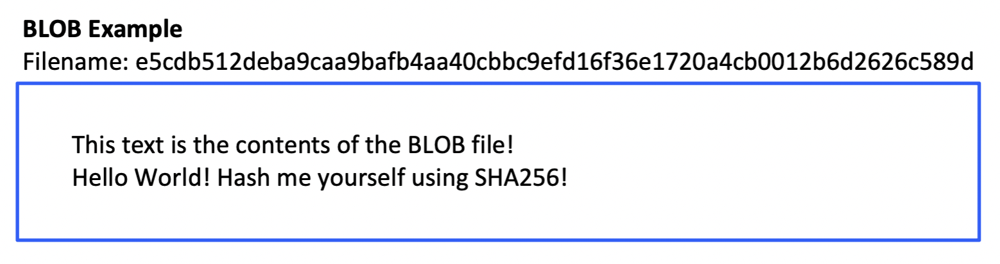

# BLOBs
*How Git stores file content as content-addressed objects*

---

## What is a Blob?

A **blob** (Binary Large Object) is how Git stores the content of a file. When you run `git add`, Git does not save your file under its original filename — it copies the file's content into the `objects/` directory under a name derived from the content itself: its SHA-1 hash.

The name "Binary Large Object" is a technical term from databases. For this project, think of it simply as: **a file stored under the name of its own hash.**

Git stores every file type this way — `.txt`, `.java`, `.png`, `.mp3` — it does not care what the content is.

## How It Works

The `git/objects/` directory behaves like a hash map on disk:

| Hash map concept | In Git's objects/ directory |
|---|---|
| **Key** | SHA-1 hash of the file's content |
| **Value** | The file's content |
| **Lookup** | Read the file named `<hash>` |

When you compute the SHA-1 hash of a file and write a copy of that file to `objects/<hash>`, you have created a blob.

## Key Properties

| Property | What it means |
|---|---|
| **Content-addressed** | The blob's filename is derived from its content, not its original name |
| **Immutable** | A blob is never modified. Changing a file creates a *new* blob with a different hash |
| **Deduplicated** | Two files with identical content share exactly one blob |
| **Format-agnostic** | Git treats all file content as raw bytes — text and binary are stored the same way |

**On immutability:** This is not a contradiction with the fact that you update the index when a file changes. The original blob is never changed — a new blob is created with the updated content, and the index entry is updated to point to the new hash. The old blob stays in `objects/` forever.

## Example

The file below has a SHA-1 hash that becomes its filename in `objects/`. The content is stored exactly as-is inside that file:

## In Your Implementation

When implementing `add(filePath)`:

1. Read the file's content
2. Compute the SHA-1 hash of that content
3. Write a copy of the file to `git/objects/<hash>`
4. Record the hash and file path in `git/index`

The blob file's name is the hash. The blob file's content is exactly what the original file contained.

---

← Back to [Docs](README.md) | [Git Project](../../)
