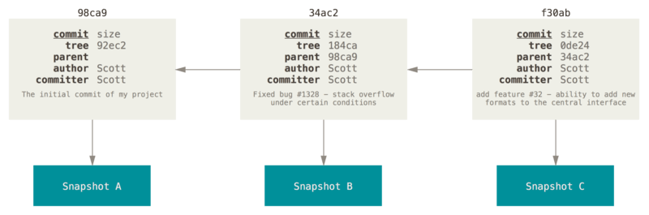

<div align="center">

# Commits
*<font color="#8b949e">How Git records snapshots and links them into a history</font>*

</div>

---

## <font color="#388bfd">What is a Commit?</font>

A **commit** is a Git object that captures the state of the entire repository at a specific moment. Like blobs and trees, it is stored in `git/objects/` under its own SHA-1 hash.

A commit ties together three things:
- **The snapshot** — a root tree hash representing all files and directories
- **The history** — a reference to the previous commit (the parent)
- **The context** — who committed, when, and what message they wrote

## <font color="#388bfd">Commit File Format</font>

```
tree: <root tree SHA-1>
parent: <previous commit SHA-1>
author: <author name>
date: <timestamp>
message: <commit message>
```

For the very first commit, omit the `parent:` line entirely — the initial commit has no predecessor.

**Example commit file:**

```
tree: 8c411a89ed6d846f064ed0decdba3a857f0d1667
parent: 2b98fbd4f414b26b612fa50b17879f62733254e6
author: Mr. Theiss
date: Thu Oct 09 11:56:39 PDT 2025
message: Add initial project files
```

## <font color="#388bfd">The Commit Chain</font>

Each commit stores a reference to the previous one. The diagram below shows three commits — each pointing to its parent and to a separate snapshot (tree):




Every commit (except the first) stores its parent's hash. This means you can start at any commit and follow the parent field backward through the entire history of the project.

```
  C1 ← C2 ← C3 ← C4
```

The chain never loops — you always terminate at the initial commit. This structure is called a **directed acyclic graph (DAG)**. The "directed" part means commits point in one direction (toward the past). The "acyclic" part means there are no loops.

## <font color="#388bfd">The HEAD File</font>

`git/HEAD` stores the SHA-1 hash of the most recent commit. It is a single-line text file.

- Before any commits: HEAD is empty
- After each commit: HEAD is updated to the new commit's hash
- On subsequent commits: HEAD's current value becomes the new commit's `parent:` field

## <font color="#388bfd">How a Commit Is Created</font>

The steps must happen in this order:

1. Read `git/index` to see what is staged
2. Build tree files for every staged directory, starting from the deepest
3. Identify the root tree's SHA-1 hash
4. Read `git/HEAD` to get the parent commit hash (empty = initial commit)
5. Build the commit file content (tree, parent if any, author, date, message)
6. Compute the SHA-1 hash of the complete commit file content
7. Write the commit file to `git/objects/<commitSHA>`
8. Update `git/HEAD` to the new commit's hash ← **must be last**

Step 8 must always come last. If HEAD is updated before the commit file is written, any crash between steps 7 and 8 would leave HEAD pointing to a non-existent commit.

---

← Back to [Docs](README.md) | [Git Project](../../)
