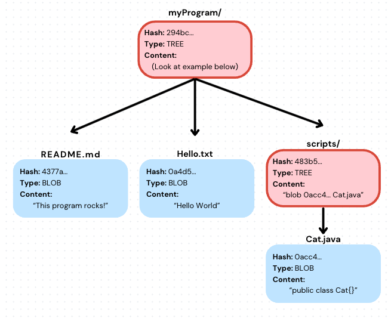

<div align="center">

# Trees
*<font color="#8b949e">How Git represents directory structure as a snapshot</font>*

</div>

---

## <font color="#388bfd">What is a Tree?</font>

A **tree** is a Git object that represents a directory at a specific point in time. It records every file and subdirectory that the directory contains, along with the hash needed to find each one.

Like blobs, a tree is stored in `git/objects/` under its own SHA-1 hash. The hash is computed from the tree file's content.

## <font color="#388bfd">Tree File Format</font>

Each line in a tree file has three parts:

```
<type> <SHA-1 hash> <name>
```

- `blob` for a file entry — the blob's hash and the filename
- `tree` for a subdirectory — that subtree's hash and the directory name

## <font color="#388bfd">Example</font>

Consider this project structure:

```
myProgram/
  README.md
  Hello.txt
  scripts/
    Cat.java
```

**Tree for `scripts/`** (innermost directory, built first):

```
blob 0acc46ad73849ea9832f600de83a014c9db9cdf0 Cat.java
```

This tree is hashed and stored as `483b5e082cf5502b303ba3dd4f3469a49495c9ef`.

**Tree for `myProgram/`** (now references the scripts/ tree by its hash):

```
blob 4377a91cdfd44db9a9bbf056849c7da0fc6cc7be README.md
blob 0a4d55a8d778e5022fab701977c5d840bbc486d0 Hello.txt
tree 483b5e082cf5502b303ba3dd4f3469a49495c9ef scripts
```

The `objects/` directory ends up with five files: two tree files and three blob files.

The diagram below shows the full object graph for this example — the root tree (`myProgram/`) references the `scripts/` tree and two blob files, and the `scripts/` tree references `Cat.java`'s blob:



## <font color="#388bfd">Trees Must Be Built Bottom-Up</font>

A parent directory's tree file needs to include the hash of each subdirectory. But you cannot compute that hash until the subdirectory's tree is already written.

This means: **always create the innermost (deepest) trees first, then work outward toward the root.**

In GP-3.2, you implement this recursively from a directory path.
In GP-3.3, you implement it from the index using a working list — because the index is flat (no directory structure), and you need to derive the hierarchy from file paths.

## <font color="#388bfd">The Root Tree</font>

The **root tree** is the topmost tree — it represents the outermost tracked directory. Its hash is stored in the commit file. If you have the root tree hash, you can trace through all the hashes and reconstruct the complete snapshot of every file and directory at commit time.

---

← Back to [Docs](README.md) | [Git Project](../../)
