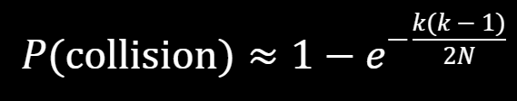

<div align="center">

# File Hashing
*<font color="#8b949e">Hash tables, the probability of collisions, and the terminal's built-in hash functions</font>*

<font color="#a371f7">Learning</font>

</div>

---

A hash table promises to find any item in constant time by computing exactly which "bucket" it lives in. That promise only holds if two items rarely land in the same bucket. Today you review how hash tables work, derive the formula that says how likely a collision is, use it to size hash tables for classrooms, governments, and galaxies, and finally meet the terminal commands that hash files into bucket spaces of wildly different sizes.

## <font color="#388bfd">Table of Contents</font>

1. [Part 1: Review hash tables, buckets, and what happens when keys collide](#part-1-hash-map-review)
2. [Part 2: Derive the probability of a collision and size a hash table with three locker examples](#part-2-probability-of-collisions)
3. [Partner activity: calculate hash table sizes for employees, humanity, sand, and stars](#activity-calculating-hash-table-sizes--click-to-expand)
4. [Part 3: Compare the terminal's hashing commands by their number of possible outputs](#part-3-terminal-hashing)
5. [Homework: size two real-world ID spaces and pick the right hash command](#homework)
6. [Check your understanding and try the stretch goals](#check-for-understanding)

---

## <font color="#388bfd">Part 1: Hash Map Review</font>

### <font color="#79c0ff">Hash Tables</font>

- **Definition:** Hash tables are data structures that store key-value pairs, allowing for efficient retrieval and insertion of data.
- **Efficiency:** They provide average-case constant time O(1) for basic operations like insert, delete, and lookup.
- **Structure:** A data structure that implements an associative array abstract data type, a structure that can map keys to values.
- **Hashing Function:** Uses a hash function to compute an index into an array of buckets or slots, from which the desired value can be found.


*You can think of each item being stored within a single "box" or "bucket".*

### <font color="#79c0ff">What will happen if a single key is used for multiple items?</font>

- **Collision Resolution:** When two keys hash to the same index, techniques like chaining (using linked lists) or open addressing (linear or quadratic probing) handle the collision.


- **Time Complexity:** With a good hash function and few collisions, insert, delete, and lookup operations average O(1) time.
  - However, using slower storage solutions like arrays and linked lists negates the speed advantage that hash maps provide. This may also complicate search capabilities.
  - **How can we mitigate this collision problem? How many keys (or "buckets") would we need to have in order to avoid collisions?**

---

## <font color="#388bfd">Part 2: Probability of Collisions</font>

Let's explore the approximation for the probability of collisions in hash functions.

Consider the following variables:

- $k$: The number of items (or inputs) being hashed
- $N$: The total number of possible hash values (size of the hash space)

We can describe the probability of a collision occurring to be the following:



### <font color="#79c0ff">Hash Table Size Calculations</font>

Let's explore a scenario where we randomly assign lockers to students. We'll calculate the probability of a collision (two students assigned the same locker) in the following exercises.

#### Example 1: 100 Lockers

**Question:** If there are 30 students in your class and 100 lockers are randomly assigned, what's the probability that at least two students are assigned the same locker?

<details>
<summary><strong>Solution</strong></summary>

$$k = 30 \text{ (Number of Students)}$$

$$N = 100 \text{ (Number of Lockers)}$$

$$P(\text{collision}) = 1 - e^{-\frac{30(30-1)}{2(100)}}$$

$$= 1 - e^{-\frac{30(29)}{200}}$$

$$= 1 - e^{-\frac{870}{200}}$$

$$= 1 - e^{-4.35}$$

$$\approx 1 - 0.0129$$

$$\approx 0.9871$$

In a scenario with 30 students and 100 lockers, there's approximately a 98.7% chance of a collision, that is, at least two students being assigned the same locker.

</details>

#### Example 2: Low Probability

**Question:** If your class has 30 students, how many lockers would you need to ensure less than a 1% chance of any two students being assigned the same locker?

<details>
<summary><strong>Answer</strong></summary>

> **Note:** With 30 lockers for 30 students, sharing is highly likely when randomly assigning them. However, if there were significantly more lockers than students, the chances of two students randomly receiving the same locker would decrease dramatically.

We need to determine how many lockers would be required to reduce the collision probability to 1% or less.

**Calculation Setup:**

1. Number of students:

$$k = 30 \text{ (Number of Students)}$$

2. The probability of a collision is 1 minus the probability of no collisions:

$$P(\text{Collision}) = 1 - P(\text{No Collision})$$

$$P(\text{Collision}) = 1 - e^{-\frac{k(k-1)}{2(N)}}$$

$$\therefore P(\text{No Collision}) = e^{-\frac{k(k-1)}{2(N)}}$$

3. The desired probability of collisions is less than or equal to 1%:

$$P(\text{Collision}) \leq 0.01$$

4. Refactor the inequality to be the following:

$$1 - e^{-\frac{k(k-1)}{2(N)}} \leq 0.01$$

$$-e^{-\frac{k(k-1)}{2(N)}} \leq -0.99$$

$$e^{-\frac{k(k-1)}{2(N)}} \geq 0.99$$

5. Therefore, we want the probability of no collisions to be greater than or equal to 99%.

**Calculation:**

1. Start with the calculation setup. The desired probability of no collisions is 99%.

$$e^{-\frac{k(k-1)}{2N}} \geq 0.99$$

2. Since there are 30 students, $k = 30$.

$$e^{-\frac{30(29)}{2N}} \geq 0.99$$

3. Take the natural log of both sides:

$$-\frac{30(29)}{2N} \geq \ln(0.99)$$

4. Solve for $N$.

$$-\frac{870}{2N} \geq \ln(0.99)$$

$$-870 \geq 2N\ln(0.99)$$

$$-\frac{870}{\ln(0.99)} \leq 2N$$

$$2N \geq \frac{-870}{\ln(0.99)}$$

$$N \geq \frac{-870}{2\ln(0.99)}$$

So we'd need approximately **43,282 lockers**. Wow.

Finally, we can establish a more general form to solve for $N$:

$$N \geq \frac{-k(k-1)}{2\ln(P)}$$

where $P$ is the desired probability of **no** collisions.

</details>

#### Example 3: 1000 Students

**Question:** If we now have 1,000 students to assign lockers to, how many lockers would we need for less than a 0.5% chance of any two students being randomly assigned the same locker?

<details>
<summary><strong>Answer</strong></summary>

1. Establish that the desired **probability of no collisions** must be greater than or equal to 99.5%.

$$P = 0.995$$

$$e^{-\frac{k(k-1)}{2N}} \geq 0.995$$

2. Solving for $N$: substitute students and the probability.

$$N \geq \frac{-k(k-1)}{2\ln(P)}$$

$$N \geq \frac{-1000(999)}{2\ln(0.995)}$$

$$N \geq 99{,}650{,}041.353\ldots$$

That's right, you would need approximately **99,650,041 lockers**! With this many lockers, it's very unlikely that two students would accidentally be assigned the same one.

</details>

👉 <details>
<summary><h3>Activity: Calculating Hash Table Sizes — click to expand</h3></summary>

*Concept: The formula $N \geq \frac{-k(k-1)}{2\ln(P)}$ tells you exactly how many buckets a hash table needs to keep collisions below a chosen probability, and the answer grows with $k^2$.*

![Flow diagram for sizing a hash table. Two inputs, k (the number of items to store) and P (the desired probability of no collision, such as 0.99), feed the formula N is at least negative k times k minus 1 over 2 ln P, which outputs N, the buckets needed, which grows like k squared. Two already-worked rows: 30 students at P = 0.99 gives about 43,282 lockers, and 1,000 students at P = 0.995 gives about 99,650,041 lockers. A "your turn" row lists the activity's inputs: 100,000 employees, 8 billion humans, 2 to the 62.72 grains of sand, and 2 to the 73.08 stars.](assets/calculating-hash-table-sizes.svg)

## Task

Partner up to tackle the following exercises on determining optimal hash table sizes. Show your work for each one.

1. **Exercise #1 — A large Hash Table (Government Employees).** Suppose the US government employs 100,000 people and assigns each a random ID. How large should the range of IDs be to ensure less than a 0.1% chance that any two employees receive the same ID?
   - A. ~5,000,000,000 IDs
   - B. ~50,000,000,000 IDs
   - C. ~500,000,000,000 IDs
   - D. ~5,000,000,000,000 IDs
2. **Exercise #2 — Just a little bigger! (Humanity-Sized).** Imagine you want to store and retrieve any person within the world's population in O(1) time using, of course, a hash table! How many buckets do you need in the table so that there's less than a 1% chance that any two people end up in the same bucket? (Assume a population of 8 billion humans.)
3. **Exercise #3 — This has got to be the biggest... (Grains of Sand).** Imagine you want to analyze every grain of sand on Earth because, well... you're into that sort of thing. Of course, you want to look up any grain of sand instantly (O(1) time, naturally). How many containers do you need in your hash table so that there's less than a 1% chance that any two grains of sand collide in your storage?

   > **Hint:** Assume there are $2^{62.72}$ (or $7.5 \times 10^{18}$) grains of sand on Earth as of last Thursday.

4. **Exercise #4 — So big it hurts... my brain (Stars in the "known" Universe).** On a blue-green planet named after dirt, a bunch of barely civilized, fur-deprived primates wildly guess the number of stars in the universe to be $2^{73.08}$. If we want to store that many planet names and look them up on Google's new Solar Search Engine in O(1) time with less than a 1% chance of a stellar collision, how many buckets does our Hash Table need?
5. **Deliverable:** Scan and upload your work using a document scanning app for online submission. You will attach it to tonight's assignment.

*(Standalone file: [activities/01-calculating-hash-table-sizes.md](activities/01-calculating-hash-table-sizes.md))*

</details>

---

## <font color="#388bfd">Part 3: Terminal Hashing</font>

Terminal has built-in hash functions that can map any input into specific bucket sizes. Here are some common Linux commands for hashing files, along with their respective number of possible outputs:

1. **sum**
   - Command: `sum filename`
   - Output: A checksum using the BSD sum algorithm. The output is typically a 16-bit value.
   - Possibilities: $2^{16} = 65{,}536$
2. **crc32**
   - Command: `crc32 filename`
   - Output: A 32-bit checksum value.
   - Possibilities: $2^{32} \approx 4.29 \times 10^{9}$
3. **md5sum**
   - Command: `md5sum filename`
   - Output: 128-bit hash, usually displayed as a 32-character hexadecimal number.
   - Possibilities: $2^{128} \approx 3.4 \times 10^{38}$
4. **sha1sum**
   - Command: `sha1sum filename`
   - Output: 160-bit hash, shown as a 40-character hexadecimal number.
   - Possibilities: $2^{160} \approx 1.46 \times 10^{48}$
5. **sha256sum**
   - Command: `sha256sum filename`
   - Output: 256-bit hash, represented as a 64-character hexadecimal number.
   - Possibilities: $2^{256} \approx 1.16 \times 10^{77}$
6. **sha512sum**
   - Command: `sha512sum filename`
   - Output: 512-bit hash, displayed as a 128-character hexadecimal number.
   - Possibilities: $2^{512} \approx 1.34 \times 10^{154}$

Try a few of them yourself. In your terminal, create a file and hash it with commands of increasing size:

```bash
echo "hash tables need room" > sample.txt
sum sample.txt
md5sum sample.txt
sha256sum sample.txt
```

> **Note:**
> On macOS the names differ slightly: use `md5` instead of `md5sum`, and `shasum -a 1`, `shasum -a 256`, or `shasum -a 512` instead of `sha1sum`, `sha256sum`, and `sha512sum`. `crc32` is not installed by default on macOS. Same algorithms, same bucket sizes.

Each command is a hash function with a fixed $N$. When you size a hash space in the homework, you are really choosing which of these commands (or which bit length) is big enough for the job.

---

## <font color="#388bfd">Homework</font>

The homework is two hash-table-sizing problems: a global cloud storage service that must give every uploaded file a unique identifier, and a bank whose customers pick random account numbers. For each, state your assumptions before your calculations and indicate which of the terminal hash functions from Part 3 is most suitable. A fully worked example (unique transaction IDs for a global payment system) is included in the assignment.

Submit a copy of your partner work from the activity above and screenshots of your two answers with their assumptions and calculations. Full instructions: [Assignment](ASSIGNMENT.md).

---

## <font color="#388bfd">☑️ Check for Understanding</font>

### <font color="#79c0ff">Introductory</font>

- [ ] Define a hash table and explain why its insert, delete, and lookup operations average O(1) time.
- [ ] Explain what a collision is and name two techniques (chaining, open addressing) that resolve one.
- [ ] Identify what $k$ and $N$ stand for in $P(\text{collision}) \approx 1 - e^{-\frac{k(k-1)}{2N}}$.
- [ ] Hash a file in the terminal with `sum`, `md5sum`, and `sha256sum` (or their macOS equivalents) and read off how many hex characters each output has.

### <font color="#79c0ff">Intermediate</font>

- [ ] Compute the collision probability for 30 students randomly assigned 100 lockers and state the result as a percentage.
- [ ] Rearrange the collision formula into $N \geq \frac{-k(k-1)}{2\ln(P)}$, where $P$ is the desired probability of no collision.
- [ ] Compute how many lockers 30 students need for less than a 1% chance of a shared locker.
- [ ] Rank `sum`, `crc32`, `md5sum`, `sha1sum`, `sha256sum`, and `sha512sum` by number of possible outputs, citing the bit length of each.

### <font color="#79c0ff">Advanced</font>

- [ ] Explain why the required number of buckets grows roughly with $k^2$ rather than with $k$.
- [ ] Size a hash space for a real-world scenario by stating assumptions, choosing a target collision probability, and solving for $N$.
- [ ] Choose the smallest terminal hash function whose $2^{\text{bits}}$ outputs exceed a computed $N$, and justify the choice.

## <font color="#388bfd">🚀 Stretch Goals</font>

- [ ] **Find a collision you can actually see:** `sum` has only 65,536 outputs. Write a loop that creates numbered files until two of them share a `sum` checksum, and report how many files it took. Compare that count with what the formula predicts for $P = 0.5$.
- [ ] **Plot the curve:** for $N = 365$ (birthdays), compute $P(\text{collision})$ for $k = 1$ through $60$ and graph it. Find the smallest $k$ where the probability passes 50%.
- [ ] **Research:** look up why MD5 and SHA-1 are considered "broken" for security even though their output spaces are enormous, and how that differs from an accidental collision.

---

[Assignment](ASSIGNMENT.md)

← [Forks and Collaboration](../ForksAndCollaboration/) — Back to [Git Usage](../)
