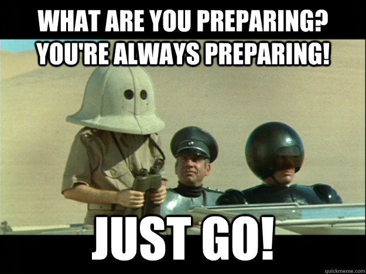

<div align="center">

# Repositories and Commits
*<font color="#8b949e">How Git tracks your work — repositories, cloning, staging, and sharing code</font>*

<font color="#a371f7">Learning</font>

</div>

---

## <font color="#388bfd">Table of Contents</font>

1. [Learn what a repository is and how Git stores its history](#what-is-a-repository)
2. [See where a repository actually lives — local vs. GitHub](#where-is-a-repository)
3. [Start tracking a project with Git two different ways](#initializing-a-repository)
4. [Download a complete copy of any repository from GitHub](#cloning-a-repository)
5. [Read GitKraken's commit graph, staging panel, and commit message area](#the-gitkraken-interface)
6. [Choose exactly which changes go into your next commit](#staging-changes)
7. [Save a permanent, labeled snapshot of your staged work](#committing-changes)
8. [Keep your local repo and GitHub in sync](#pushing-and-pulling)

---

## <font color="#388bfd">What is a Repository?</font>

A **repository** (repo) is a project folder that Git has been set up to track. It stores not just your current files but the entire history of every change ever saved — who made it, when, and why.

That history lives inside a hidden folder called `.git` at the root of your project. Every commit, every branch, every author name and timestamp is stored in there. You will never edit `.git` directly — Git manages it for you through commands like `git commit` and `git push`. But knowing it exists explains why a repo folder seems "normal" while carrying years of history.

```bash
ls -a                   # show hidden files — you will see .git listed
ls .git                 # peek inside: branches, commits, config, objects
```

> **Tip:**
> A name that starts with a dot, like `.git`, is the Unix convention for a **hidden file or folder** — a plain `ls` (and your file manager) skips over anything named this way by default, since it's meant for tools to read, not for you to browse. That's the whole reason `.git` doesn't clutter your project folder even though it's quietly holding your entire history. `ls -a` — the `a` is for "all" — overrides that and shows hidden names too.

👉 <details>
<summary><h3>Activity: The Hidden Detective — click to expand</h3></summary>

*Concept: Proving that a repository's history lives locally, inside the hidden `.git` folder.*

## Task

1. Open your terminal and create a new folder anywhere convenient, then move into it:
   ```bash
   mkdir git-detective
   cd git-detective
   ```
2. Turn it into a repository:
   ```bash
   git init
   ```
3. List the folder's contents normally:
   ```bash
   ls
   ```
   Nothing prints — the folder looks empty.
4. Now list *all* files, including hidden ones:
   ```bash
   ls -a
   ```
   You should see `.git` in the output. That's the folder `git init` just created.
5. Move inside it and look around:
   ```bash
   cd .git
   ls
   ```
   You're looking at Git's raw machinery: `objects/` (where every version of every file is actually stored), `refs/` (where branch names point to), and `HEAD` (a plain text file naming your current branch).
6. Return to your project root before you finish:
   ```bash
   cd ..
   ```

*(Standalone file: [activities/01-the-hidden-detective.md](activities/01-the-hidden-detective.md))*

</details>

---

## <font color="#388bfd">Where is a Repository?</font>

A single repository actually exists in two places at once, and Git treats them as genuinely separate copies:

| Type | Where | Purpose |
|---|---|---|
| **Local** | Your machine | Where you write and test code |
| **Remote** | GitHub (or similar) | Shared backup and collaboration hub |

Your **local** repo is just a folder on your computer with a `.git` inside it — it works completely offline, and every commit you make happens there first. Your **remote** repo is that same project hosted on the internet (GitHub, in this course), so anyone with access can see it, clone it, or collaborate on it.

The two stay in sync through **push** (local → remote) and **pull** (remote → local). Git never assumes the two are in sync — you always sync them explicitly. This means you can commit freely offline and push everything when you are ready.

> **Note:**
> The remote is not a real-time mirror. Until you push, changes you commit locally exist only on your machine. Until you pull, changes others pushed exist only on GitHub.

---

## <font color="#388bfd">Initializing a Repository</font>

### <font color="#79c0ff">Recommended: create on GitHub first, then clone</font>

1. Go to GitHub and click **New repository**
2. Give it a name, set it to public or private, and click **Create repository**
3. Copy the URL and clone it (see [Cloning a Repository](#cloning-a-repository) below)

This approach sets up the remote automatically so there is nothing to configure.

### <font color="#79c0ff">Alternative: initialize locally</font>

```bash
git init
```

This creates a `.git` folder in the current directory. Git now tracks this folder. To connect it to GitHub afterward:

```bash
git remote add origin https://github.com/username/repo-name.git
git push -u origin main
```

**In GitKraken:** folder icon (top left) → Init → Local Only → select your folder → Create Repository.

> **Tip:**
> Creating on GitHub first and cloning is cleaner for beginners — the remote is already configured when you clone.

---

## <font color="#388bfd">Cloning a Repository</font>

**Cloning** downloads a complete copy of a repository to your machine — not just the current files but the entire commit history, all branches, and all metadata.

```bash
git clone https://github.com/username/repo-name.git
cd repo-name
```

After cloning:
- The project files are in your current directory
- The full commit history is available locally — run `git log` to see it
- Git has automatically configured `origin` to point to the URL you cloned from

```bash
# Verify the remote was set up automatically
git remote -v
# origin  https://github.com/username/repo-name.git (fetch)
# origin  https://github.com/username/repo-name.git (push)
```

**Cloning vs downloading a ZIP:**

| | `git clone` | Download ZIP |
|---|---|---|
| Gets commit history | Yes — every past commit | No — current files only |
| Sets up remote | Yes — `origin` is ready | No — disconnected from GitHub |
| Can push changes | Yes | No |

Always clone. Downloading a ZIP gives you the files but none of the Git machinery that makes collaboration possible.

**Finding the URL:** click the green or blue **Code** button on any GitHub repository page and copy the HTTPS link.

**In GitKraken:** click **Clone a Repo** on the home screen → paste the repository URL → choose a destination folder → click **Clone the repo!**

👉 <details>
<summary><h3>Activity: Clone vs. ZIP Challenge — click to expand</h3></summary>

*Concept: A cloned repository is a living thing with history attached; a downloaded ZIP is a dead snapshot with none.*

## Task

1. Go to [github.com/octocat/Hello-World](https://github.com/octocat/Hello-World) — GitHub's own tiny demo repository.
2. Click **Code → Download ZIP**. Extract the ZIP into a folder named `dead-repo`.
3. In your terminal, clone the same repository into a folder named `live-repo`:
   ```bash
   git clone https://github.com/octocat/Hello-World.git live-repo
   ```
4. Open a terminal inside `dead-repo` and run:
   ```bash
   git status
   git log
   ```
   Write down the exact error each command gives you.
5. Now open a terminal inside `live-repo` and run the same two commands:
   ```bash
   git status
   git log
   ```
   Write down what each one shows you this time.
6. Compare your two write-ups. `dead-repo` has no `.git` folder at all — it's just files, disconnected from GitHub, with none of its own history. `live-repo` carries the entire project history and already knows where it came from.

*(Standalone file: [activities/02-clone-vs-zip-challenge.md](activities/02-clone-vs-zip-challenge.md))*

</details>

---

## <font color="#388bfd">The GitKraken Interface</font>

When you open a repository in GitKraken, three areas matter most:

- **Commit graph** (center) — each dot is a commit; lines show how branches diverge and merge; the top is the most recent work
- **Unstaged / Staged panel** (top right) — files you have changed since the last commit; click the `+` to stage a file
- **Commit message panel** (bottom right) — the Summary field (required) and Description field (optional) before you click **Commit Changes**

The commit graph is the visual record of your project. Every dot is a decision that was made and saved.

---

## <font color="#388bfd">Staging Changes</font>

In plain English, "saving" your work in Git actually happens in two stages: **staging**, then **committing**. Staging is a preparation step that lets you choose exactly which changes to include in the next commit. Even if you modified ten files, you can commit just one.

```bash
git status              # see what has changed since the last commit
git add filename.txt    # stage a specific file
git add .               # stage every changed file in the current directory
git status              # run again to confirm what is now staged
```

After `git add`, run `git status` again. Staged files appear under **"Changes to be committed"** — these are the files that will be saved in the next commit. Unstaged files will not be included.

> **Note:**
> `git add .` stages everything changed in your current directory. Use `git add filename` when you want precise control over what a commit contains — for example, when you fixed two separate bugs and want one commit per fix.

**In GitKraken:** changed files appear in the top-right panel. Click the `+` next to any file to stage it, or click **Stage all changes**.

---

## <font color="#388bfd">Committing Changes</font>



Staging is the preparing. Committing is the "just go" — it's where the save actually happens. A commit saves a permanent, labeled snapshot of everything currently staged. Every commit requires a message explaining what changed.

```bash
git commit -m "Short present-tense description of what changed"
```

**Writing good commit messages:**

| Good | Too vague |
|---|---|
| `Fix login redirect after password reset` | `fixed stuff` |
| `Add dark mode toggle to settings page` | `update` |
| `Remove duplicate user check in registration` | `changes` |

- Use **present tense**: `Add feature` not `Added feature`
- Be **specific**: a future reader should understand what changed without reading the diff
- Describe **what and why**, not how

> **Important:**
> Commits are permanent. You cannot easily undo one without rewriting history. Think about the message before you commit.

**In GitKraken:** fill in the **Summary** field and optionally a **Description**, then click **Commit Changes**.

👉 <details>
<summary><h3>Activity: The Split Commit — click to expand</h3></summary>

*Concept: The staging area gives you granular control over exactly what gets saved in a commit.*

## Task

1. Inside the `live-repo` folder you cloned in the previous activity, create two new files:
   ```bash
   echo "Feature A" > feature-a.txt
   echo "Feature B" > feature-b.txt
   ```
2. Using GitKraken (or `git add feature-a.txt` in the terminal), stage **only** `feature-a.txt` — leave `feature-b.txt` untouched.
3. Commit just the staged file with a descriptive message, e.g. `Add feature A`.
4. Run `git status` and confirm `feature-b.txt` still shows up as an untracked/unstaged change — it was deliberately left behind.
5. In your own words, write one sentence explaining what would have happened to `feature-b.txt` if you had run `git add .` instead of `git add feature-a.txt`.

*(Standalone file: [activities/03-the-split-commit.md](activities/03-the-split-commit.md))*

</details>

---

## <font color="#388bfd">Pushing and Pulling</font>

Pushing is a third stage hiding behind the word "saving": staging prepares it, committing saves it locally, and pushing saves it online. So saving your work in Git is secretly three steps — stage, commit, push.

**Push** uploads your local commits to GitHub so teammates (and backups) can see them:

```bash
git push
```

**Pull** downloads and integrates the latest commits from GitHub into your local repo:

```bash
git pull
```

> **Tip:**
> Always `git pull` before starting new work. If someone pushed changes while you were away, pulling first means you are working from the latest version and are less likely to encounter conflicts when you push.

**In GitKraken:** use the **Push** and **Pull** buttons in the top toolbar.

---

## <font color="#388bfd">☑️ Check for Understanding</font>

- [ ] I can explain the difference between a local repository on my machine and a remote repository on GitHub.
- [ ] I can successfully clone a repository using its URL rather than downloading it as a ZIP file.
- [ ] I understand that the `.git` folder is hidden, starts with a dot, and contains my project's entire history.
- [ ] I can explain the difference between staging (preparing) a file and committing (saving) it.
- [ ] I can write a clear, present-tense commit message that explains what changed and why.
- [ ] I can push my local commits to GitHub and verify they appear online.

## <font color="#388bfd">🚀 Stretch Goals</font>

- [ ] **The "Undo" Preview:** Research what the `git restore --staged <file>` command does and test it on a file you accidentally staged.
- [ ] **Terminal Mastery:** Try completing the entire workflow (clone, create file, add, commit, push) entirely in the command line without opening GitKraken.
- [ ] **Investigate the Config:** Open the `.git` folder you created in Activity 1 and read the `config` file in a text editor to see how Git tracks your remote URLs.

---

[Assignment](ASSIGNMENT.md)

← Back to [Git Usage](../) — Next: [Branching and Merging](../BranchingAndMerging/)
